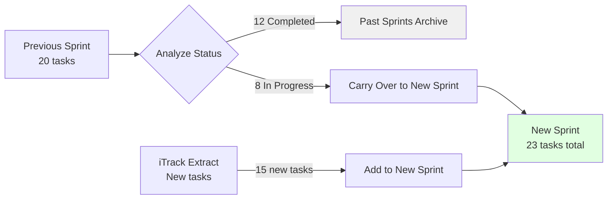
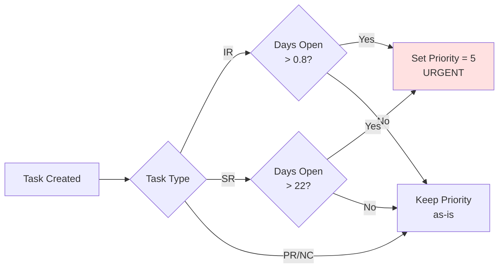
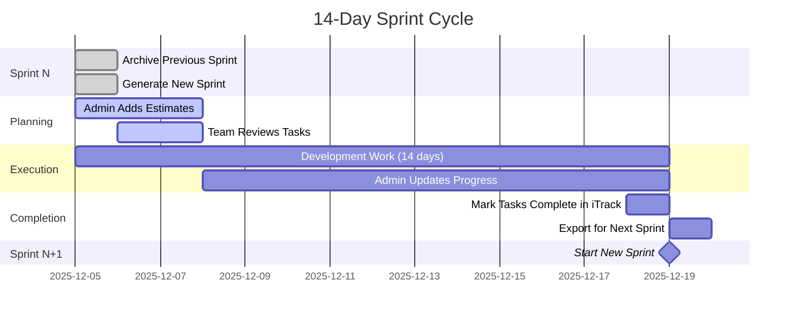

# Sprint Dashboard Workflow Diagram

## Complete System Workflow

```mermaid
flowchart TB
    Start([Start Sprint Cycle]) --> ExportiTrack[Export Data from iTrack]
    
    ExportiTrack --> iTrackFile[(iTrack Extract CSV<br/>UTF-16 Tab-delimited)]
    
    iTrackFile --> Upload[Upload to<br/>New Sprint Page]
    
    Upload --> Validate{Validate<br/>CSV Format?}
    
    Validate -->|Invalid| Error1[Show Error Message]
    Error1 --> Upload
    
    Validate -->|Valid| Preview[Preview iTrack Data<br/>- Total tasks<br/>- Unique tickets<br/>- Assignees<br/>- Teams]
    
    Preview --> Configure[Configure New Sprint<br/>- Sprint number<br/>- Start date Thu<br/>- Duration 14 days]
    
    Configure --> Generate[Click Generate Sprint]
    
    Generate --> CheckCurrent{Current Sprint<br/>Exists?}
    
    CheckCurrent -->|Yes| Archive[Archive Current Sprint<br/>to Past Sprints<br/>ALL tasks included]
    CheckCurrent -->|No| AnalyzeCarryover
    
    Archive --> LoadPrevious[Load Previous Sprint<br/>with ALL tasks]
    
    LoadPrevious --> AnalyzeCarryover[Analyze Tasks]
    
    AnalyzeCarryover --> FilterCompleted{Task Status?}
    
    FilterCompleted -->|Completed/Closed| PastOnly[Add to Past Sprints Only<br/>Not carried over]
    FilterCompleted -->|In Progress/New| Carryover[Identify as Carryover<br/>Update from fresh iTrack]
    
    PastOnly --> PastSprintsDB
    
    Carryover --> UpdateCarryover[Update Carryover Tasks:<br/>- Fresh status<br/>- Fresh priority<br/>- Fresh assignee<br/>- Clear effort estimate]
    
    UpdateCarryover --> NewTasks[Identify New Tasks<br/>Created after previous<br/>sprint end date]
    
    NewTasks --> Escalate[Apply TAT Escalation<br/>- IR: 0.8 days → Priority 5<br/>- SR: 22 days → Priority 5]
    
    Escalate --> Combine[Combine Tasks:<br/>Carryover + New]
    
    Combine --> CreateSprint[Create New Current Sprint<br/>- Sprint metadata<br/>- Task list<br/>- Default priority 3]
    
    CreateSprint --> CurrentSprintDB[(Current Sprint CSV<br/>Active tasks only)]
    
    CurrentSprintDB --> PlanningPhase[Planning Phase<br/>Admin Reviews Sprint]
    
    PlanningPhase --> ViewDashboard{Which View?}
    
    ViewDashboard -->|Dashboard| ShowDashboard[📊 Dashboard<br/>Show ACTIVE tasks only<br/>- Stats<br/>- Charts<br/>- By team]
    
    ViewDashboard -->|Plan Sprint| ShowPlan[✏️ Plan Sprint<br/>Show ACTIVE tasks only<br/>Edit in grid:<br/>- Effort estimate<br/>- Dependencies<br/>- Comments]
    
    ViewDashboard -->|Section View| ShowSection[👥 Section View<br/>Show ACTIVE tasks only<br/>Filtered by team<br/>Read-only for users]
    
    ShowDashboard --> UpdateTasks
    ShowPlan --> UpdateTasks[Admin Updates Tasks<br/>Save changes]
    ShowSection --> WorkContinues
    
    UpdateTasks --> CurrentSprintDB
    
    UpdateTasks --> WorkContinues{Sprint<br/>Complete?}
    
    WorkContinues -->|No| ViewDashboard
    WorkContinues -->|Yes - 14 days| EndSprint[End of Sprint]
    
    EndSprint --> ReviewComplete[Admin Reviews:<br/>Mark tasks as completed<br/>in iTrack]
    
    ReviewComplete --> NextCycle[Ready for Next Sprint]
    
    NextCycle --> ExportiTrack
    
    CurrentSprintDB -.->|Archive at<br/>end of sprint| PastSprintsDB[(Past Sprints Archive<br/>ALL tasks<br/>Complete history)]
    
    PastSprintsDB --> Analytics[📈 Analytics<br/>Historical data<br/>All sprints]
    
    style iTrackFile fill:#e1f5ff
    style CurrentSprintDB fill:#fff4e1
    style PastSprintsDB fill:#f0f0f0
    style Archive fill:#ffe1e1
    style Carryover fill:#e1ffe1
    style PastOnly fill:#f0f0f0
    style ShowDashboard fill:#e1f5ff
    style ShowPlan fill:#ffe1f5
    style ShowSection fill:#f5e1ff
```



## Key Concepts

### 📥 Data Sources

1. **iTrack Extract (Input)**
   - Fresh export from iTrack system
   - UTF-16 tab-delimited format
   - Contains all active tickets/tasks
   - Updated status, priority, assignees

2. **Current Sprint (Working File)**
   - Only ONE active sprint at a time
   - **Filtered view:** Shows ACTIVE tasks only (no completed)
   - **Actual file:** Contains all tasks
   - Used for planning and daily work
   - Updated by admins with estimates/dependencies

3. **Past Sprints (Archive)**
   - Historical record of ALL sprints
   - Contains EVERY task (completed + incomplete)
   - Includes all annotations (effort, dependencies, comments)
   - Used for analytics and reporting

### 🔄 Sprint Generation Logic



**Math:**
- Previous Sprint: 20 tasks (12 completed, 8 incomplete)
- Archive: +20 tasks (ALL preserved)
- New Sprint: 8 carryover + 15 new = 23 tasks

### 👁️ View Filtering

| View | Shows | Purpose |
|------|-------|---------|
| **Dashboard** | Active tasks only | Monitor progress |
| **Plan Sprint** | Active tasks only | Add estimates |
| **Section View** | Active tasks only | Team's work |
| **Analytics** | Active tasks | Current metrics |
| **Past Sprints** | ALL tasks | Historical analysis |

### ⏱️ TAT Escalation Rules



**Ticket Type Labels:**
- **Incident Request (IR)** - Urgent issues
- **Service Request (SR)** - Standard requests
- **Project Request (PR)** - Project work
- **Not Classified (NC)** - Uncategorized

### 🚧 Forever Ticket Exclusion

The following tickets are automatically excluded from all metrics:
- Tasks with subject containing "Standing Meeting"
- Tasks with subject containing "Miscellaneous Meetings"

These are recurring tasks that would skew metrics if included.

### 👥 Team Member Filtering

Tasks are filtered to only show those assigned to configured team members.
Configure in `.streamlit/itrack_mapping.toml` under `[team_members]` section.

### 📊 Sprint Workflow Timeline



## User Roles & Actions

### 👨‍💼 Admin (Project Admin)
- ✅ Generate new sprints
- ✅ Upload iTrack extracts
- ✅ Add effort estimates
- ✅ Set dependencies
- ✅ Update priorities
- ✅ View all sections
- ✅ Archive sprints

### 👨‍🔬 Section User (Lab Team Member)
- ✅ View their section's tasks only
- ✅ See effort estimates
- ✅ Read-only access
- ❌ Cannot edit
- ❌ Cannot generate sprints

## Data Flow Summary

```
iTrack System
    ↓ [Export]
iTrack Extract CSV (UTF-16)
    ↓ [Upload]
Sprint Dashboard
    ↓ [Validate & Map Columns]
Normalized Data
    ↓ [Generate Sprint]
    ↓
    ├─→ Archive Old Sprint → Past Sprints (ALL tasks)
    ↓
    ├─→ Identify Carryover (Incomplete tasks)
    ├─→ Identify New Tasks (From iTrack)
    ├─→ Apply TAT Escalation
    ↓
Current Sprint (Active tasks view)
    ↓ [Planning]
Admin Adds Estimates/Dependencies
    ↓ [During Sprint]
Team Works on Tasks
    ↓ [End Sprint]
Tasks Completed in iTrack
    ↓ [Next Cycle]
Export Fresh iTrack Data
```

## Critical Rules

1. ✅ **Only ONE current sprint** at a time
2. ✅ **Current sprint shows ACTIVE tasks only** (completed filtered out)
3. ✅ **Archive includes ALL tasks** (completed + incomplete)
4. ✅ **Only incomplete tasks carry over** to next sprint
5. ✅ **TAT escalation** applied to overdue tasks
6. ✅ **Sprint duration is always 14 days** (Thu → Wed)
7. ✅ **Capacity limit is 52 hours** per team member per sprint
8. ✅ **Fresh iTrack data** used to update carryover tasks
9. ✅ **Forever tickets excluded** from all metrics (Standing/Miscellaneous Meetings)
10. ✅ **Team member filtering** - only configured members shown

## Status Workflow (iTrack)

```
Logged → Assigned → Accepted → Waiting → Completed/Closed
  🔵       🟡        🔵        🟠         🟢
```

| Status | Color | Meaning |
|--------|-------|--------|
| Logged | 🔵 Blue | New, unassigned |
| Assigned | 🟡 Yellow | Assigned, awaiting acceptance |
| Accepted | 🔵 Cyan | Actively working |
| Waiting | 🟠 Amber | On hold |
| Completed/Closed | 🟢 Green | Finished |
| Canceled | ⚪ Gray | Excluded |

---

---

**Version 0.2.0** — Updated December 15, 2024
